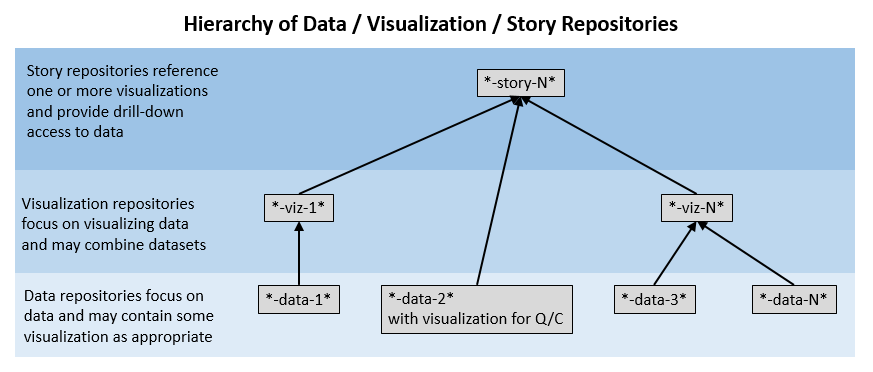

# Open Water Foundation on GitHub

The Open Water Foundation (OWF) is a nonprofit social enterprise that focuses on open source software
and open data to make better decisions about water resources.
Water is a public resource and we believe that data and software tools should also be public
(while also allowing for commercial solutions to be created that leverage open solutions).  See:

* [Open Water Foundation website](http://openwaterfoundation.org) for more information about OWF
* [Open Water Foundation GitHub repositories](https://github.com/OpenWaterFoundation)

OWF tries to make its work public via GitHub and other cloud resources.

## Repository Naming Conventions ##

Most OWF GitHub repositories follow a naming convention that helps keep repositories organized,
using a dash-delimited repository name with names that include:

* Owner/Steward/System
  + First part of the repository name indicates the owner/steward or system for the work.
  + "owf" indicates product created by OWF.
  + "cdss" indicates product that is part of Colorado's Decision Support Systems (CDSS).
* Data/Visualizations/Stories
  + "data" indicates a dataset, for example maintained in Excel and exported to other forms such as
  comma-separated value and GeoJSON.
  + "viz" indicates a visualization, typically a stand-alone website that can be viewed locally with a Python http server,
  and can be published as a static website.
  + "story" indicates a story.
* Model/analysis
  + "model" indicates a model.
* Project
  + "proj" indicates project files.
* Software
  + "lib" indicates a library.
  + "app" indicates an desktop application.
  + "webapp" indicates a web application.
  + "ws" indicates web service.
  + "util" indicates utility.
  + "java", "python", "fortran", "js", etc. indicate the primary programming language.
* Documentation
  + "learn" indicates training/learning resources.
  + "doc-dev" indicates developer documentation.
  + "doc-user" indicates user documentation.
  + "website" indicates a website.

## Grouping Repositories for Products ##

Some repositories are intended to be used together, in which case the leading part of the repository names
will often be consistent.  For example:

* owf-app-geoprocessor-python
* owf-app-geoprocessor-python-test
* owf-app-geoprocessor-python-doc-user

To coordinate product development, OWF typically recommends using a folder structure that represents
organization / product / git-repos / repositories..., for example:

```
C:\Users\user\                                         User files.
    owf-dev\                                           Work for an organization/system.
        GeoProcessor\                                  Product.
            git-repos\                                 Folder for repositories.
                owf-app-geoprocessor-python            Each repository...
                owf-app-geoprocessor-python-test
                owf-app-geoprocessor-python-doc-user
```

The above allows tools such as scripts in one repository to reference other repositories using `../` notation.
Consequently, the grouped repositories are transportable between entities.

## Hierarchy of Data / Visualization / Story Repositories ##

Repositories that are related to data and information may be related as shown in the following diagram.



In this case, the goal is to separate concerns related to data, visualization, and stories so that
the specific product in the hierarchy can be independently maintained and can be layered as needed.
For example, the following situations may occur:

* Repository contains relatively simple dataset that is versioned in Excel.
* Repository contains simple dataset that is versioned in Excel and also includes basic visualization to
understand context of data and quality control.
  + The visualization is mainly used in local files when the dataset is being reviewed for quality.
* Repository contains a visualization of a separate dataset, with expectation that the visualization
could be used similarly for other datasets.
  + The visualization and data are published/deployed on a website.
* Repository contains a visualization that requires integrating multiple datasets, which are each
maintained in separate repositories.
  + The visualization and data are published/deployed on a website (or multiple websites).
* Repository contains a story that leverages one or more datasets and one or more visualizations.
  + The story can link to local computer resources for development,
  and may refer to published visualizations and datasets.
  
To accomplish the above, local computer repositories may be organized as in the previous section,
and a simple Python (or other suitable) web server is run to view a visualization or story locally
before publishing to the web.
